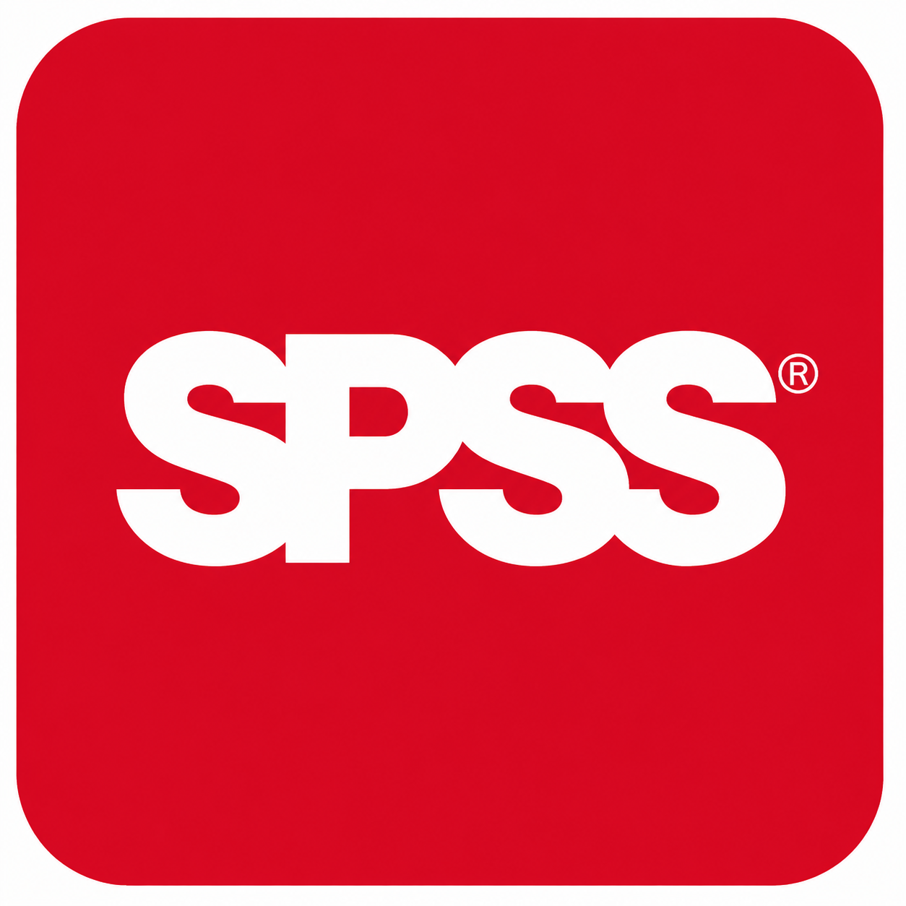

# Hi, I'm Kelly Kigan

### Development Research | Qualitative Analysis | Quantitative Analysis | R, Stata, SPSS & Python

I am a development research professional with practical experience in qualitative and quantitative research, data analysis, and evidence generation. I use **R, Stata, SPSS, and Python** to clean, analyse, visualise, and interpret data, and Python to build AI-assisted workflows for research and data tasks.

## What I Do

* Clean and prepare datasets for analysis
* Conduct exploratory and statistical analysis
* Produce clear data visualisations
* Apply quantitative methods to development research questions
* Conduct qualitative and quantitative research
* Build reproducible research workflows
* Translate research findings and statistical results into development-relevant insights

## Technical Toolkit

  
  &nbsp;&nbsp;&nbsp;&nbsp;
  
  &nbsp;&nbsp;&nbsp;&nbsp;
  
  &nbsp;&nbsp;&nbsp;&nbsp;
  

| Tool | Application |
| --- | --- |
| **R** | Data cleaning, exploratory analysis, statistical analysis and visualisation |
| **Stata** | Data management, descriptive statistics and quantitative research analysis |
| **SPSS** | Data management, statistical analysis and quantitative research |
| **Python** | Data preparation, analysis, visualisation, and building AI agents for research and data workflows |

## What You'll Find Here

My repositories document practical research projects from **raw data to findings**, including:

**Data preparation → Exploratory analysis → Statistical analysis → Visualisation → Interpretation**

The focus is on applying analytical tools to real-world research questions rather than programming for its own sake.

## Explore My Work

Explore my repositories to see the code, workflows, documentation, analysis, visualisations, and interpretations behind my projects.

**My GitHub is a record of practical learning and applied quantitative research.**
